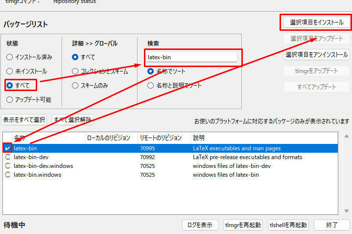

[![GitHub License][license-shield]][license-url]

[![Paypal][Paypal-shield]][Paypal-url][![BuyMeACoffee][BuyMeACoffee-sheild]][BuyMeACoffee-url]

<!-- PROJECT LOGO -->
 

  <h3 align="center">Simple-LaTeX-Starter</h3>

  

    シンプルにLaTeXをセットアップして文書を書こう
     
  

1. [Demo](#demo)
2. [Focus](#focus)
    1. [xymtex を使用するときの情報源](#xymtex-を使用するときの情報源)
3. [Installation](#installation)
    1. [TeX Live のインストールとコレクションのインストール](#tex-live-のインストールとコレクションのインストール)
    2. [vscode のインストールと設定](#vscode-のインストールと設定)
    3. [vscode のインストール](#vscode-のインストール)
    4. [vscode 拡張機能のインストール](#vscode-拡張機能のインストール)
4. [Usage](#usage)
    1. [このリポジトリをダウンロードする](#このリポジトリをダウンロードする)
        1. [A: zip としてダウンロード](#a-zip-としてダウンロード)
        2. [B: git clone する](#b-git-clone-する)
    2. [このリポジトリを開く](#このリポジトリを開く)
    3. [タイプセットをして pdf を作成する](#タイプセットをして-pdf-を作成する)
    4. [作成した pdf を画面を分けて表示](#作成した-pdf-を画面を分けて表示)
    5. [画像などのファイルを手軽に貼り付ける](#画像などのファイルを手軽に貼り付ける)
    6. [スニペットを使う](#スニペットを使う)
5. [License](#license)

## Demo

サンプル(/srcs/simple-report)の.tex をタイプセットし、その結果を右側に表示しながら書き換えている様子を示す。

具体的な入力例を[/srcs/simple-report.tex](/srcs/simple-report.tex)、その出力例を[/examples/srcs/simple-report/simple-report.pdf](/examples/srcs/simple-report/simple-report.pdf)に示す。

(<a href="#readme-top">back to top</a>)

## Focus

ここではセットアップと例示のみを取り扱う。
具体的な LaTeX の記載方法については[TeX Wiki](https://texwiki.texjp.org/)や Web 検索の結果を参照。

### xymtex を使用するときの情報源

化学構造を書く場合には

-   [@TeX-seminar XyMTeX 美構造式作成入門](https://qiita.com/TeX-seminar/items/c11f8b364d6391737b20#%E5%8E%9F%E5%AD%90%E3%83%AA%E3%82%B9%E3%83%88)

化学反応を書く場合には

-   [LaTeX で化学構造式 --- XyMTeX の紹介](http://web.archive.org/web/20090224162250/http://www.klavis.info/xym.html#react)

それでも不明なことがあれば[xymtex(catan)](https://ctan.org/pkg/xymtex)から xymtex.zip をダウンロードし、xymtex/doc/XyMTeX-manual.pdf を参照するとよい。

(<a href="#readme-top">back to top</a>)

## Installation

### TeX Live のインストールとコレクションのインストール

フルスキームですべてインストールすることが望ましいが、7GB ほどの容量を必要とする。

ここでは科学実験レポートに向けた実践で必要な機能に絞りインストールする。ここで上げているものをインストールすると 3GB ほどとなる。

-   install-tl.zip をダウンロード
    -   [Installing TeX Live over the Internet - TeX Users Group](https://www.tug.org/texlive/acquire-netinstall.html)
-   install-tl-windows.bat を起動する
-   高度な設定 → スキーム →minimal スキームを選び OK
    -   
    -
    -   
-   tex live manager を起動する
    -   
-   必要なものを検索、チェックを入れて「選択項目をインストール」でインストールしていく
    -   コレクションとスキームに絞ると探しやすい
    -   
    -   必要なもの(3GB くらい)
        -   collection-binextra
        -   collection-bibextra
        -   collection-langjapanese
        -   collection-latex
        -   collection-latexextra
            -   float が付属している
                -   その位置に表示する
        -   collection-luatex
            -   メインで使うもの
        -   collection-mathscience
            -   化学系
                -   xymtex が付属している
                    -   化学構造図を描画できる
        -   collection-pstrics
            -   xymtexps を使用してよりきれいな化学構造図を作るのに必要
        -   collection-pictures
        -   collection-wintools

(<a href="#readme-top">back to top</a>)

### vscode のインストールと設定

LaTeX そのものはテキストファイルで記述するため、編集に用いるツールはメモ帳でも何でもよい。

しかし、保存時にタイプセットを行ったり出力 pdf を随時確認するには何かしらのエディタを扱うと便利である。

ここでは vscode の設定を用意したため、vscode とその拡張機能をインストールし、快適に LaTeX を記述・タイプセットするための設定を行う。

また、vscode は ssh や wsl のリモート接続に対応しており、より高速な LaTeX タイプセットを求めて linux に移行した際にもそのまま扱うことができる。

(<a href="#readme-top">back to top</a>)

### vscode のインストール

-   公式サイトよりダウンロード・インストールを行う
    -   [https://code.visualstudio.com/](https://code.visualstudio.com/)

(<a href="#readme-top">back to top</a>)

### vscode 拡張機能のインストール

-   画面左下部分から次図のように拡張機能管理画面を開く
    -   
-   LaTeX Workshop を検索しインストールする
    -   
-   Paste Image (mushan 作)を検索しインストールする
    -   

ここまで導入を行った後、ショートカットキーが被っているためそれを修正する。

-   画面左下部分からショートカット設定画面を開く
    -   
-   「latex view」で検索する
    -   
-   デフォルトでは Ctrl+Alt+V になっている
    -   画像を貼り付ける PasteImage もこのキーになっている
-   この行をダブルクリックし、キーバインドを設定する
    -   おすすめは Ctrl+K→V
        -   vscode の拡張機能ではこのショートカットをプレビューに割り当てることがままある
    -   Ctrl ＋ K を押した後に Ctrl を離し、V を押す

(<a href="#readme-top">back to top</a>)

## Usage

### このリポジトリをダウンロードする

[A](#a-zipとしてダウンロード)、[B](#b-git-cloneする)のどちらかの方法でこのリポジトリをダウンロードする。

#### A: zip としてダウンロード

-   次のリンクから zip としてダウンロード・展開をする。

    -   [https://github.com/Shumpei-Tanaka/Simple-LaTeX-Starter/archive/refs/heads/main.zip](https://github.com/Shumpei-Tanaka/Simple-LaTeX-Starter/archive/refs/heads/main.zip)

#### B: git clone する

-   git でこのリポジトリをクローンする

### このリポジトリを開く

-   ダウンロードしたこのリポジトリ内にある[Simple-LaTeX-Starter.code-workspace](/Simple-LaTeX-Starter.code-workspace)を vscode で開く

-   ファイルツリーが図のようになる
    -   
-   .vscode/setting.json に LaTeX を扱う設定が記載されている
    -   これはこのフォルダを vscode で開くことで自動で反映される
-   srcs/simple-report.tex をそのまま vscode 上で開く

### タイプセットをして pdf を作成する

-   Ctrl+Alt+B を押す
    -   buildtex/に出力結果が現れる

### 作成した pdf を画面を分けて表示

-   Ctrl+K→V と押す
    -   出力された pdf を画面右半分に開くことができる

### 画像などのファイルを手軽に貼り付ける

-   画像ファイルをコピーした状態にする
-   srcs/simple-report.tex のどこかの行を編集状態にする
-   Ctrl+Alt+V を押す
-   画像が自動で srcs/simple-report.tex_assets/にコピーされる
-   その保存した場所へのパスが srcs/simple-report.tex に入力される

### スニペットを使う

vscode にはよく使う定型文をすばやく書くためのスニペットと呼ばれる機能がある。

LaTeX における画像の貼り付け、表の作成、段落間の空行、プログラムコードの貼付けに使えるスニペットをサンプルとして用意したため、これを紹介する。

スニペットの定義は[/.vscode/latex.code-snippets](/.vscode/latex.code-snippets)にある。

具体的な使用方法は以下の通り

-   srcs/simple-report.tex のどこかの行を編集状態にする
-   次の表の命令のどれかを打ち込むと自動補完され、矢印キーで選択し Enter を押すとスニペットが展開される。

| 命令文   | 機能                                       |
| -------- | ------------------------------------------ |
| sfigure  | 画像を貼り付ける場所を用意する             |
| stable   | 表の雛形を作成                             |
| smargine | 段落間などに空行を挿入                     |
| scode    | プログラムコードを貼り付ける場所を用意する |

(<a href="#readme-top">back to top</a>)

<!-- LICENSE -->

## License

The source code is licensed MIT. See [LICENSE.md][license-url].

(<a href="#readme-top">back to top</a>)

[license-shield]: https://img.shields.io/github/license/Shumpei-Tanaka/Simple-LaTeX-Starter?flat-square
[license-url]: /LICENSE.md
[Paypal-shield]: https://img.shields.io/badge/paypal.me-s6tanaka-white?style=flat-squere&logo=paypal
[Paypal-url]: https://paypal.me/s6tanaka
[BuyMeACoffee-sheild]: https://img.shields.io/badge/buy_me_a_coffee-s6tanaka-white?style=flat-squere&logo=buymeacoffee&logocolor=#FFDD00
[BuyMeACoffee-url]: https://www.buymeacoffee.com/s6tanaka
