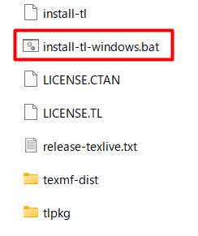
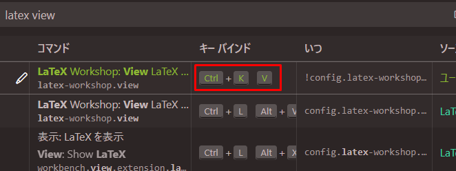
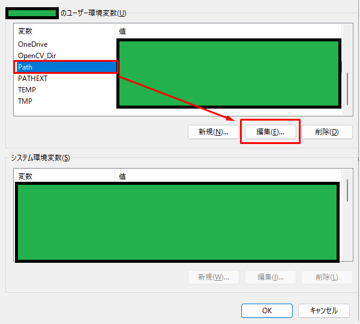
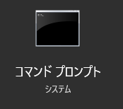
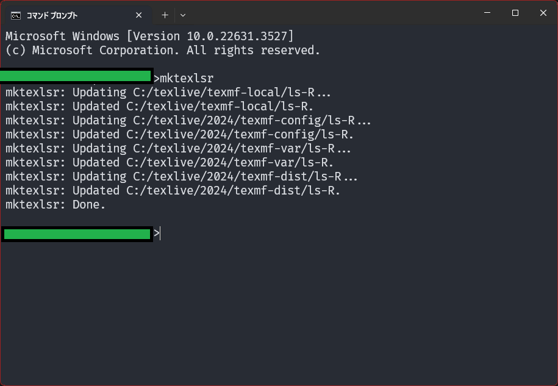

<a name="readme-top"></a>

[![GitHub License][license-shield]][license-url]

[![Paypal][Paypal-shield]][Paypal-url][![BuyMeACoffee][BuyMeACoffee-sheild]][BuyMeACoffee-url]

<!-- PROJECT LOGO -->
<br />
<div align="center">

  <h3 align="center">Simple-LaTeX-Starter</h3>

  <p align="center">
    シンプルに $\LaTeX$ をセットアップして文書を書こう
    <br />
  </p>
</div>

1. [Demo](#demo)
2. [Focus](#focus)
    1. [xymtex を使用するときの情報源](#xymtex-を使用するときの情報源)
3. [Installation](#installation)
    1. [TeX Live のインストールとコレクションのインストール](#tex-live-のインストールとコレクションのインストール)
        1. [TeX Live の基本環境のみのインストール](#tex-live-の基本環境のみのインストール)
        2. [TeX Live の拡張機能をインストール](#tex-live-の拡張機能をインストール)
    2. [vscode のインストールと設定](#vscode-のインストールと設定)
    3. [vscode のインストール](#vscode-のインストール)
    4. [vscode 拡張機能のインストール](#vscode-拡張機能のインストール)
4. [Usage](#usage)
    1. [このリポジトリをダウンロードする](#このリポジトリをダウンロードする)
        1. [A: zip としてダウンロード](#a-zip-としてダウンロード)
        2. [B: git clone する](#b-git-clone-する)
    2. [このリポジトリを開く](#このリポジトリを開く)
    3. [タイプセットをして pdf を作成する](#タイプセットをして-pdf-を作成する)
    4. [作成した pdf を画面を分けて表示](#作成した-pdf-を画面を分けて表示)
    5. [画像などのファイルを手軽に貼り付ける](#画像などのファイルを手軽に貼り付ける)
    6. [スニペットを使う](#スニペットを使う)
5. [License](#license)
6. [Appendix](#appendix)
    1. [Windowsのユーザー名が日本語文字を含む場合にインストール失敗することの回避方法](#windowsのユーザー名が日本語文字を含む場合にインストール失敗することの回避方法)
        1. [日本語文字を含まない新しいtempフォルダを作る](#日本語文字を含まない新しいtempフォルダを作る)
        2. [`TEMP`、`TMP`環境変数を設定しなおす](#temptmp環境変数を設定しなおす)
    2. [手動でパスを通す](#手動でパスを通す)
        1. [前提](#前提)
        2. [手順](#手順)
            1. [`TeX Live`のインストール先を確認する](#tex-liveのインストール先を確認する)
            2. [`パスを通す`](#パスを通す)
    3. [TeX Liveのアンインストール](#tex-liveのアンインストール)
        1. [Uninstall TeX Liveを使用してアンインストール](#uninstall-tex-liveを使用してアンインストール)
        2. [インストール先(`C\:texlive`)フォルダを削除する](#インストール先ctexliveフォルダを削除する)
    4. [Sumatra PDF](#sumatra-pdf)
    5. [フォントを変更するとエラーが出てタイプセットできないときの対処](#フォントを変更するとエラーが出てタイプセットできないときの対処)
        1. [`luatexja`パッケージの手動アップデート手順](#luatexjaパッケージの手動アップデート手順)

## Demo

サンプル(/srcs/simple-chem-report)の.tex をタイプセットし、その結果を右側に表示しながら書き換えている様子を示す。


具体的な入力例を[/srcs/simple-chem-report.tex](/srcs/simple-chem-report.tex)、その出力例を[/examples/srcs/simple-chem-report/simple-chem-report.pdf](/examples/srcs/simple-chem-report/simple-chem-report.pdf)に示す。

<p align="right">(<a href="#readme-top">back to top</a>)</p>

## Focus

ここではセットアップと例示のみを取り扱う。
具体的な $\LaTeX$ の記載方法については[TeX Wiki](https://texwiki.texjp.org/)や Web 検索の結果を参照。

### xymtex を使用するときの情報源

化学構造を書く場合には

-   [@TeX-seminar XyMTeX 美構造式作成入門](https://qiita.com/TeX-seminar/items/c11f8b364d6391737b20#%E5%8E%9F%E5%AD%90%E3%83%AA%E3%82%B9%E3%83%88)

化学反応を書く場合には

-   [LaTeXで化学構造式 --- XyMTeX の紹介](http://web.archive.org/web/20090224162250/http://www.klavis.info/xym.html#react)

それでも不明なことがあれば[xymtex(catan)](https://ctan.org/pkg/xymtex)から xymtex.zip をダウンロードし、xymtex/doc/XyMTeX-manual.pdf を参照するとよい。

<p align="right">(<a href="#readme-top">back to top</a>)</p>

## Installation

### TeX Live のインストールとコレクションのインストール

フルスキームですべてインストールすることが望ましいが、7GB ほどの容量を必要とする。

ここでは科学実験レポートに向けた実践で必要な機能に絞りインストールする。ここで上げているものをインストールすると 3GB ほどとなる。

#### TeX Live の基本環境のみのインストール

TeX Live を最小構成でインストールする。これは $\LaTeX$ さえ付属しない、ほとんど $\LaTeX$ 用のインストーラのようなものとなる。

※ $\LaTeX$ は TeX を使いやすくしたものであり、TeX Live の最小構成では TeX のみが付属するため。

この手順では、インストール開始後、1 分程で完了する。インストール終了後、使用容量は 300MB ほどとなる。

> [!CAUTION]
> Windowsのユーザー名が日本語文字の場合、インストールが途中で止まったままになる。
> [付録:Windowsのユーザー名が日本語文字を含む場合にインストール失敗することの回避方法](#windowsのユーザー名が日本語文字を含む場合にインストール失敗することの回避方法)をこの手順の前に実行することで、途中で止まってしまう現象を回避する。

-   `install-tl.zip` をダウンロード
    -   [Installing TeX Live over the Internet - TeX Users Group](https://www.tug.org/texlive/acquire-netinstall.html)
    -   
-   `install-tl.zip`を`日本語文字を含まない場所`へ移動・解凍する
    -   `日本語文字を含まない場所`は例えば`C:\ws`など
    -   `ドキュメント`や`ダウンロード`自体は問題ないが、これは`ユーザーフォルダ`の下にある。
        -   `ユーザー名`が日本語文字を含む場合、`ユーザーフォルダ`が日本語文字になってしまうため、`ドキュメント`や`ダウンロード`は不可となる
-   `install-tl-windows.bat` を起動する
    -   
-   TeX Live インストーラが表示されたら、`特定のミラーを選択`から日本のどれかを選択する
    -   
    -   あまりにも時間がかかるようであればここを選択し直してみると解決するかもしれない。
-   インストーラが自動で次の画面に遷移する。
    -   
-   `高度な設定`ボタン → `スキーム`の行の`変更`ボタン →`minimal スキーム`を選び、OK を押す
    -   
    -
    -   
    -
    -   
-   正しく`minimal スキーム`を選択できていれば次のような表示になる。
    -   
-   この状態を確認した後、`インストール`ボタンの押しインストールを開始する
    -   
-   １分ほどで次のようなログで終了し、基本環境のインストールは完了となる
    -   

#### TeX Live の拡張機能をインストール

$\LaTeX$ で文書を作る際に必要となるであろう拡張機能をインストールしていく。

この手順では、インストール開始後 1 時間ほどで終了する。インストール終了後、使用容量は 4GB ほどとなる。

-   TLShell TeX Live Manager を起動する

    -   
    -   次のエラーが発生し起動できないようであれば、[手動でパスを通す](#手動でパスを通す)を実行する
        -   

-   必要なものを全てにチェックを入れ`選択項目をインストール`ボタンを押しインストールを開始する。
    -   コレクションとスキームに絞ると探しやすい
    -   
    -   必要なもの
        -   collection-bibtexextra
        -   collection-binextra
        -   collection-langjapanese
        -   collection-latex
        -   collection-latexextra
            -   float が付属している
                -   その位置に表示する
        -   collection-luatex
            -   メインで使うもの
        -   collection-mathscience
            -   化学系
                -   xymtex が付属している
                    -   化学構造図を描画できる
        -   collection-pictures
        -   collection-pstrics
            -   xymtexps を使用してよりきれいな化学構造図を作るのに必要
    -   `選択項目をインストール`を押すとインストールが始まり、次のようなログが出始める
        -   
-   次のような表示で終了すればインストールが正しく完了となる
    -   

<p align="right">(<a href="#readme-top">back to top</a>)</p>

### vscode のインストールと設定

$\LaTeX$ そのものはテキストファイルで記述するため、編集に用いるツールはメモ帳でも何でもよい。

しかし、保存時にタイプセットを行ったり出力 pdf を随時確認するには何かしらのエディタを扱うと便利である。

ここでは vscode の設定を用意したため、vscode とその拡張機能をインストールし、快適に $\LaTeX$ を記述・タイプセットするための設定を行う。

また、vscode は ssh や wsl のリモート接続に対応しており、より高速な $\LaTeX$ タイプセットを求めて linux に移行した際にもそのまま扱うことができる。

<p align="right">(<a href="#readme-top">back to top</a>)</p>

### vscode のインストール

-   公式サイトよりダウンロード・インストールを行う
    -   [https://code.visualstudio.com/](https://code.visualstudio.com/)

<p align="right">(<a href="#readme-top">back to top</a>)</p>

### vscode 拡張機能のインストール

-   画面左下部分から次図のように拡張機能管理画面を開く
    -   
-   LaTeX Workshop を検索しインストールする
    -   
-   Paste Image (mushan 作)を検索しインストールする
    -   

ここまで導入を行った後、ショートカットキーが被っているためそれを修正する。

-   画面左下部分からショートカット設定画面を開く
    -   
-   「latex view」で検索する
    -   
-   デフォルトでは Ctrl+Alt+V になっている
    -   画像を貼り付ける PasteImage もこのキーになっている
-   この行をダブルクリックし、キーバインドを設定する
    -   おすすめは Ctrl+K→V
        -   vscode の拡張機能ではこのショートカットをプレビューに割り当てることがままある
    -   Ctrl ＋ K を押した後に Ctrl を離し、V を押す

<p align="right">(<a href="#readme-top">back to top</a>)</p>

## Usage

### このリポジトリをダウンロードする

[A](#a-zipとしてダウンロード)、[B](#b-git-cloneする)のどちらかの方法でこのリポジトリをダウンロードする。

#### A: zip としてダウンロード

-   次のリンクから zip としてダウンロード・展開をする。

    -   [https://github.com/Shumpei-Tanaka/Simple-LaTeX-Starter/archive/refs/heads/main.zip](https://github.com/Shumpei-Tanaka/Simple-LaTeX-Starter/archive/refs/heads/main.zip)

#### B: git clone する

-   git でこのリポジトリをクローンする

### このリポジトリを開く

-   ダウンロードしたこのリポジトリ内にある[`Simple-LaTeX-Starter.code-workspace`](/Simple-LaTeX-Starter.code-workspace)を vscode で開く

-   ファイルツリーが図のようになる
    -   
-   .vscode/setting.json に $\LaTeX$ を扱う設定が記載されている
    -   これは`Simple-LaTeX-Starter.code-workspace`を vscode で開くことで自動で反映される
-   srcs/simple-chem-report.tex をそのまま vscode 上で開く

### タイプセットをして pdf を作成する

-   Ctrl+Alt+B を押す
    -   buildtex/に出力結果が現れる

### 作成した pdf を画面を分けて表示

-   Ctrl+K→V と押す
    -   出力された pdf を画面右半分に開くことができる

### 画像などのファイルを手軽に貼り付ける

-   画像ファイルをコピーした状態にする
-   srcs/simple-chem-report.tex のどこかの行を編集状態にする
-   Ctrl+Alt+V を押す
-   画像が自動で srcs/simple-chem-report.tex_assets/にコピーされる
-   その保存した場所へのパスが srcs/simple-chem-report.tex に入力される

### スニペットを使う

vscode にはよく使う定型文をすばやく書くためのスニペットと呼ばれる機能がある。

$\LaTeX$ における画像の貼り付け、表の作成、段落間の空行、プログラムコードの貼付けに使えるスニペットをサンプルとして用意したため、これを紹介する。

スニペットの定義は[/.vscode/latex.code-snippets](/.vscode/latex.code-snippets)にある。

具体的な使用方法は以下の通り

-   srcs/simple-chem-report.tex のどこかの行を編集状態にする
-   次の表の命令のどれかを打ち込むと自動補完され、矢印キーで選択し Enter を押すとスニペットが展開される。

| 命令文   | 機能                                       |
| -------- | ------------------------------------------ |
| @figure  | 画像を貼り付ける場所を用意する             |
| @table   | 表の雛形を作成                             |
| @margine | 段落間などに空行を挿入                     |
| @code    | プログラムコードを貼り付ける場所を用意する |

<p align="right">(<a href="#readme-top">back to top</a>)</p>

<!-- LICENSE -->

## License

The source code is licensed MIT. See [LICENSE.md][license-url].

<p align="right">(<a href="#readme-top">back to top</a>)</p>

## Appendix

### Windowsのユーザー名が日本語文字を含む場合にインストール失敗することの回避方法

#### 日本語文字を含まない新しいtempフォルダを作る

-   `C:\ws\temp`となるようにフォルダを作る
    -   フォルダは通常通り右クリックから`新規作成`で作成する
        -   
    -   `C:\ws\temp`を開き表示が次のようになっていれば正しい
        -   

#### `TEMP`、`TMP`環境変数を設定しなおす

-   `環境変数を編集`を開く。方法はいくつかある

    -   A: `Windowsキー`を押し、`環境変数を編集`を検索して開く
        -   
    -   B: `コントロールパネル`から検索して開く
        -   `コントロールパネル`を開く
            -   
        -   右上の検索欄に`環境変数`と検索し、`環境変数を編集`を開く
            -   

-   上の`ユーザー環境変数`の中から`TEMP`を選択し、`編集`ボタンを押す
    -   
-   `ディレクトリを参照`ボタンを押し、[日本語文字を含まない新しいtempフォルダを作る](#日本語文字を含まない新しいtempフォルダを作る)で作成した`C:\ws\temp`のフォルダを指定する
    -   
    -   
-   正しく指定できると次の図のように`C:\ws\temp`が`変数値`欄に記載される。この状態で`OK`を押す
    -   
-   正しく設定できると次の図のように`TEMP`の行の`値`列が`C:\ws\temp`に書き換わる
    -   
-   同じ手順で`TMP`も書き換え、`TEMP`、`TMP`両方が`C:\ws\temp`になっていることを確認して`OK`を押す
    -   
-   これで途中終了を回避するための設定は完了となる

### 手動でパスを通す

`Pathを通す`と呼ばれる操作がある。これはPCでアプリを探す場所を登録し、実行するものを名前で見つけられるようにする操作である。

通常はインストーラが自動でこの操作を行い、`TeX Live`内のものをPC上で扱えるようにしてくれる。しかし再インストールを繰り返しても自動で行われない場合を確認したため、ここに手動で`Pathを通す`手順を記載しておく。

#### 前提

-   [TeX Live の基本環境のみのインストール](#tex-live-の基本環境のみのインストール)を終えている。
-   TLShell TeX Live Manager を起動すると、次のようなエラーが発生する
    -   
    -   

#### 手順

##### `TeX Live`のインストール先を確認する

-   フォルダを`PC`→`C`→`texlive`と開き、`C:\texlive`を表示する
    -   
-   正しく開けると次図のような表示になる
    -   
-   検索欄を使って`kpsewhich.exe`を検索する
    -   検索欄はこの位置
        -   
    -   検索すると次のように発見できる
        -   
        -   発見できない場合、そもそもインストールに失敗しているかインストール先を間違えている。
        -   インストール先を変えずに手順を実行しているならば一度[アンインストール](#tex-liveのアンインストール)し、[TeX Live の基本環境のみのインストール](#tex-live-の基本環境のみのインストール)をやり直す
        -   インストール先を変えているならばそのインストール先で検索する
    -   発見した`kpsewhich.exe`を右クリックし、`プロパティ`を開く
        -   
    -   開いた`プロパティ`の`場所`行に表示されているものを`メモ帳`などにコピーしておく
        -   

##### `パスを通す`

-   `環境変数を編集`を開く。方法はいくつかある

    -   A: `Windowsキー`を押し、`環境変数を編集`を検索して開く
        -   
    -   B: `コントロールパネル`から検索して開く
        -   `コントロールパネル`を開く
            -   
        -   右上の検索欄に`環境変数`と検索し、`環境変数を編集`を開く
            -   

-   上の`ユーザー環境変数`の中から`Path`を選択し、`編集`ボタンを押す
    -   
-   `新規`ボタンを押し、現れた入力欄に[TeX Live のインストール先を確認する](#tex-liveのインストール先を確認する)で確認した`kpsewhich.exe`の場所を入力し`OK`ボタンを押す
    -   
-   `OK`を押して終了する
    -   
-   これで`Pathを通す`作業は完了となる。

### TeX Liveのアンインストール

ある程度インストールが進んでいれば[Uninstall TeX Liveを使用してアンインストール](#uninstall-tex-liveを使用してアンインストール)が使える。

`Uninstall TeX Live`が見つからない場合、[インストール先(C\\:texlive) フォルダを削除する](#インストール先ctexliveフォルダを削除する)

#### Uninstall TeX Liveを使用してアンインストール

-   `Uninstall TeX Live`を検索し開く
    -   
-   しばらくするとアンインストールが完了する

#### インストール先(`C\:texlive`)フォルダを削除する

-   フォルダを`PC`→`C`→と開き、`C:\texlive`を削除する
    -   

### Sumatra PDF

PDFをPCで見るにはSumatra PDFがおすすめ

-   [Sumatra PDF official](https://www.sumatrapdfreader.org/free-pdf-reader)
-   [Sumatra PDF official Download](https://www.sumatrapdfreader.org/download-free-pdf-viewer)

-   利点
    -   余計な購入促しがない
    -   画面が広くとれ、PDFを読みやすい
    -   日本語に対応している
    -   PDFのパスワードを保存でき、いちいち再入力が必要ない

### フォントを変更するとエラーが出てタイプセットできないときの対処

次のようなエラーが出てタイプセットできないときの対処法

```
Undefined control sequence.
\__ltj_fontspec_setup_single_size:nnn ...fss:Nnnn
```

これは2024/05/05と2024/05/11のfontspec更新によるエラー

既に報告・FIXが入っている

-   [luatexja-fontspec エラー ! Undefined control sequence. okumuralab.org/tex/mod/forum](https://okumuralab.org/tex/mod/forum/discuss.php?d=3755)
-   [luatexja-fontspec の Undefined control sequence github.com/luatexja/luatexja/issues/6](https://github.com/luatexja/luatexja/issues/6)
-   [luatexja-preset の \ltjapplypreset に関するクラッシュ github.com/luatexja/luatexja/issues/8](https://github.com/luatexja/luatexja/issues/8)

2024/05/17では`TeX Live`にまだ更新がアップロードされていないため、
`luatexja`パッケージの手動アップデートが必要

#### `luatexja`パッケージの手動アップデート手順

-   次のリンクから最新版をダウンロードする
    -   [https://github.com/luatexja/luatexja/tags](https://github.com/luatexja/luatexja/tags)
    -   
    -   フォルダを`PC`→`C`→`texlive`と開き、`C:\texlive`を表示する
    -   
-   正しく開けると次図のような表示になる
    -   
-   `C:\texlive\[バージョン]\texmf-dist\tex\luatex\luatexja`まで開く
    -   
-   ダウンロードした`luatexja-[version].zip`の中の`src`の中身を`C:\texlive\[バージョン]\texmf-dist\tex\luatex\luatexja`にすべて上書きする
-   
-   コマンドプロンプトを開く
    -   
    -   
-   `mktexlsr`を実行する
    -   
-   手順はこれで終了。タイプセットできるようになっているか確認する

<p align="right">(<a href="#readme-top">back to top</a>)</p>

[license-shield]: https://img.shields.io/github/license/Shumpei-Tanaka/Simple-LaTeX-Starter?flat-square
[license-url]: /LICENSE.md
[Paypal-shield]: https://img.shields.io/badge/paypal.me-s6tanaka-white?style=flat-squere&logo=paypal
[Paypal-url]: https://paypal.me/s6tanaka
[BuyMeACoffee-sheild]: https://img.shields.io/badge/buy_me_a_coffee-s6tanaka-white?style=flat-squere&logo=buymeacoffee&logocolor=#FFDD00
[BuyMeACoffee-url]: https://www.buymeacoffee.com/s6tanaka
